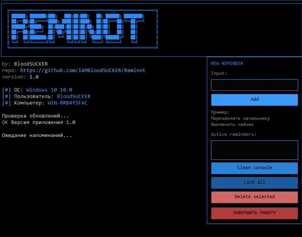

# Reminot

Reminot - минималистичное desktop-приложение для быстрых напоминаний в Windows.
Открыл, добавил текст и время, получил системное уведомление без лишней возни с календарями и телефоном.

[](https://github.com/IAMBloodSUCKER/Reminot/releases/latest)
[](https://github.com/IAMBloodSUCKER/Reminot/releases)

## Поддержать проект

Если приложение оказалось полезным, можно отправить донат:

- **EVM-адрес:** `0xe4a1bf07aa8c2194ab94d72812364968ac5b58e3`
- **Сеть (рекомендуется для низкой комиссии):** `Arbitrum` или `Base`
- **Что отправлять:** `ETH`, `USDT`, `USDC` (в выбранной сети)

Поддерживаемые сети этого кошелька (по профилю DeBank): `Arbitrum`, `zkSync Era`, `Polygon`, `Base`, `Optimism (OP)`, `Ethereum`, `BNB Chain`.

## За 2 минуты до запуска

1. Открой [последний релиз](https://github.com/IAMBloodSUCKER/Reminot/releases/latest)
2. Скачай `Reminot-*.exe`
3. Установи и запусти
4. Нажми `ADD`, введи время, получи напоминание

## Как это выглядит



## Что умеет приложение

- добавлять напоминания по дате и времени
- показывать активные напоминания в правой панели
- удалять напоминания из списка
- хранить данные локально у каждого пользователя
- выводить системные уведомления Windows

## Скачать и запустить

### Готовый EXE (рекомендуется)

1. Открой [Releases](https://github.com/IAMBloodSUCKER/Reminot/releases)
2. Скачай последний `Reminot-*.exe`
3. Запусти установщик и открой приложение

### Запуск из исходников

Требования:
- JDK 17+
- Maven 3.9+

Команды:

```bash
cd backend
mvn clean package
java -jar target/reminot-1.0.14.jar
```

## Сборка JAR

```bash
cd backend
mvn -DskipTests clean package
```

Готовый файл:
- `backend/target/reminot-1.0.14.jar`

## Сборка EXE (Windows)

Требования:
- Windows 10/11
- JDK 17+ (в составе JDK есть `jpackage`)
- Maven

Команда:

```powershell
cd backend
.\build-exe.ps1 -AppVersion 1.0.14
```

По умолчанию иконка берется из `docs/media/label.ico`.
Если нужен другой файл:

```powershell
.\build-exe.ps1 -AppVersion 1.0.14 -IconPath "..\docs\media\my-icon.ico"
```

Если иконку не удалось применить на CI-раннере, сборка автоматически повторяется без иконки, чтобы релиз не падал.

Результат:
- portable app image в `backend/dist/Reminot/`
- installer `*.exe` в `backend/dist/`
- portable архив `*portable.zip` в `backend/dist/` (можно запускать без установки)
- важно: сначала полностью распакуйте архив, затем запускайте `start-reminot.bat` или `Reminot.exe`

## Можно ли запускать без установленной Java

Да, можно.
Если приложение собрано через `jpackage`, в EXE уже включается runtime, поэтому пользователю не нужно отдельно ставить Java.

## FAQ

**Нужна ли Java пользователю, который скачал EXE?**  
Нет, не нужна. Runtime уже внутри установщика, собранного через `jpackage`.

**Почему у меня не работает команда `mvn`?**  
Скорее всего Maven не установлен или не добавлен в `PATH`. Установи Maven 3.9+ и перезапусти терминал.

**Почему не находится `jpackage`?**  
Обычно установлен только JRE или старый JDK. Нужен JDK 17+ (лучше 21), где есть `jpackage`.

**Где лежат пользовательские данные?**  
В `%LOCALAPPDATA%\Reminot\` (база напоминаний и логи).

## Локальные данные пользователя

Reminot хранит данные локально в профиле пользователя:

- база напоминаний: `C:\Users\<USER>\AppData\Local\Reminot\notifications.db.txt`
- журнал событий: `C:\Users\<USER>\AppData\Local\Reminot\events.log`
- технический лог: `C:\Users\<USER>\AppData\Local\Reminot\app.log`

## Автосборка EXE в GitHub Actions

В репозитории добавлен workflow:
- `.github/workflows/release-windows.yml`

Он:
- собирает JAR
- собирает EXE
- прикладывает EXE в Release (для тегов `v*`)

Чтобы выпустить новую версию:

```bash
git tag v1.0.14
git push origin v1.0.14
```

После этого в `Releases` появится готовый EXE для скачивания.

Прямая ссылка на последнюю версию:
- [https://github.com/IAMBloodSUCKER/Reminot/releases/latest](https://github.com/IAMBloodSUCKER/Reminot/releases/latest)

## Чеклист перед релизом

- увеличить версию в `backend/pom.xml` при необходимости
- убедиться, что локально проходит сборка: `mvn -DskipTests clean package`
- закоммитить изменения и запушить в `main`
- создать и запушить тег формата `vX.Y.Z`
- проверить, что GitHub Action завершился успешно
- проверить, что `exe` появился в [Releases](https://github.com/IAMBloodSUCKER/Reminot/releases)

## Команды для релиза (готовый шаблон)

```bash
git add .
git commit -m "Prepare release v1.0.14"
git push origin main
git tag v1.0.14
git push origin v1.0.14
```
